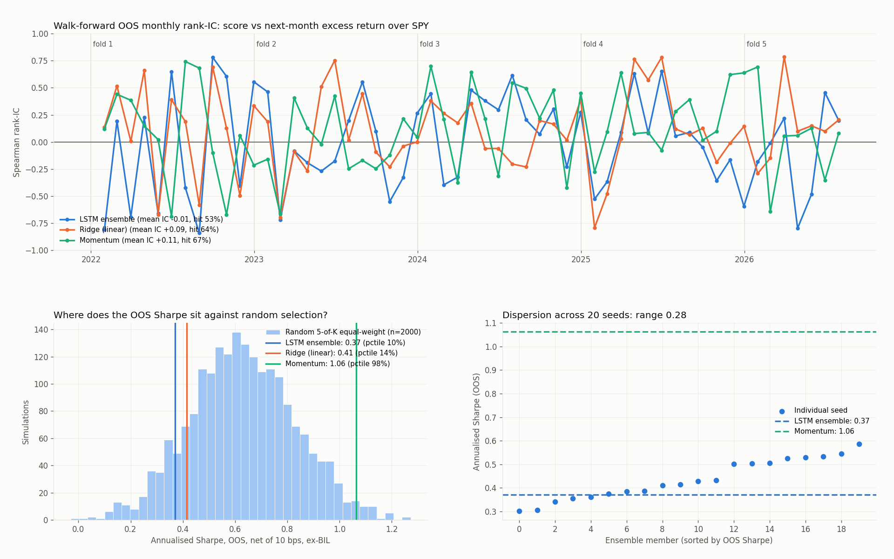
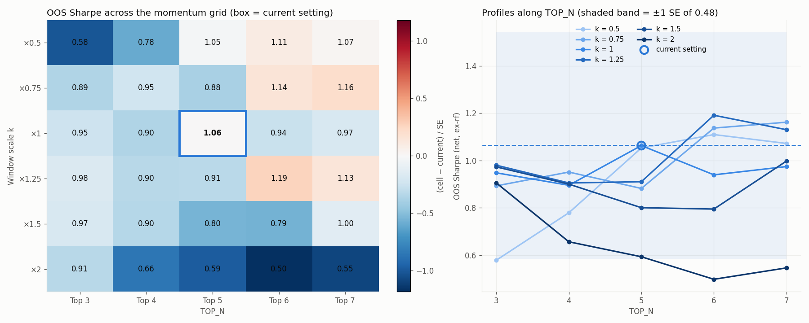
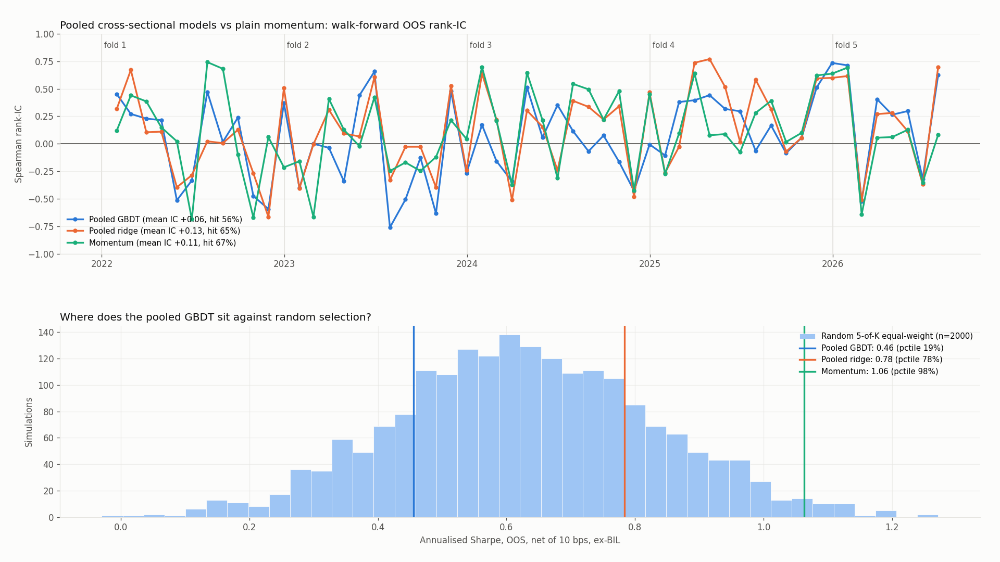
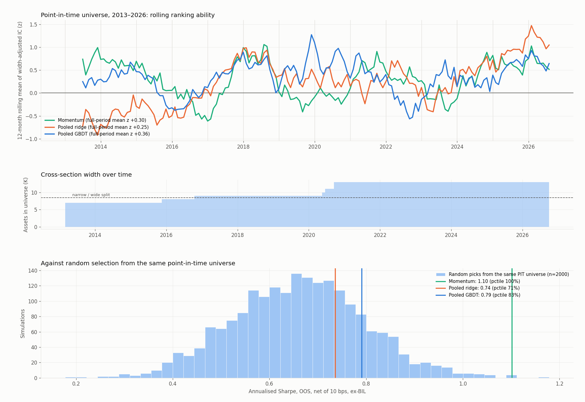
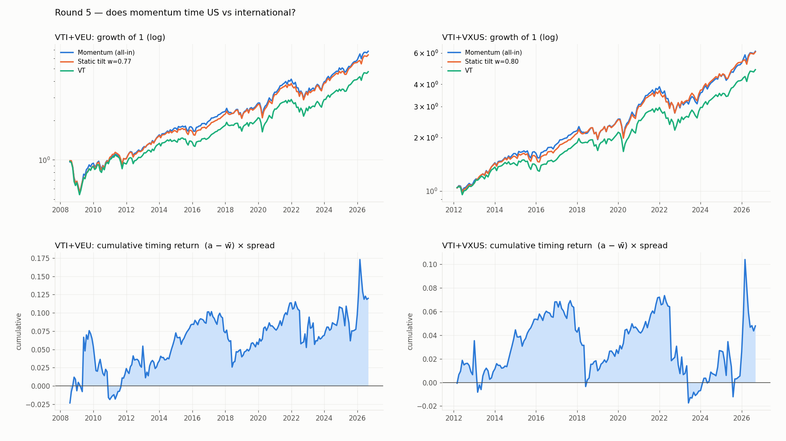

# DeepAlpha-ETF: Does an Ensemble LSTM Beat Momentum at Monthly ETF Rotation?


A research pipeline that asks one question: **can an ensemble LSTM trained on price and macro features rank a
13-ETF universe by next-month excess return over SPY better than a plain momentum rule?** The pipeline is built so
that the answer is decided by pre-registered criteria computed by code, not by reading an equity curve.

**Answer (walk-forward, 2022-02 to 2026-08, 55 months): no.** The LSTM has no detectable out-of-sample ranking
ability (monthly rank-IC −0.01, t = −0.16), is not better than a ridge regression on the same features, and its
net-of-cost Sharpe sits at the 10th percentile of random 5-of-13 selection. Simple 3/6/12-month momentum has a
rank-IC of +0.11 (t = 2.1) and a Sharpe at the 98th percentile of the same null.

Four pre-registered rounds have now been run, each committed and pushed before it was executed:
**round 1** rejected the ensemble LSTM, **round 2** confirmed the momentum baseline is a plateau rather
than a lucky parameter, **round 3** rejected a pooled cross-sectional LightGBM built specifically to fix
the LSTM's structural flaw, **round 4** retested everything on a point-in-time universe with three
times the sample — where momentum's ranking ability finally clears significance (t = 2.9 over 163
months and five stress episodes) while neither ML model beats it — and **round 5** narrowed the
question to US vs international with a benchmark built from the universe, where momentum's advantage
turns out to be a static tilt rather than timing. Details below.

One thing this repo does **not** show: that momentum beats the market on a risk-adjusted basis. Asked
directly, that difference is +0.18 Sharpe with a 95% CI of [−0.31, +0.69] and a sign that flips across
sub-periods. What is established is narrower — momentum ranks better than chance *within* a given
universe.

## What the pipeline does

| Step | Script | What it does |
| :--- | :--- | :--- |
| 1 | `_1_fetch_and_clean_data.py` | Downloads adjusted closes for a pinned window (`START_DATE`/`END_DATE` in `_config.py`); forward-fills only, errors on leading NaN |
| 2 | `_2_baseline_performance.py` | Momentum baseline (mean of 3/6/12-month returns, top-5, absolute-momentum filter to cash). Also holds the **shared backtest accounting** used by every strategy |
| 3 | `_3_ml_data_pipeline.py` | Features (SPY 200-day trend and 20-day vol, per-ETF daily return / vol / 20-60-120-day momentum), 20-day forward excess-return targets, and **walk-forward folds with purging** |
| 4 | `_4_lstm_model.py` | Trains one 20-seed LSTM ensemble per fold, early-stopped on that fold's validation tail |
| 4b | `_4b_ridge_baseline.py` | Ridge regression on the same features, targets and folds; alpha picked by validation MSE |
| 5 | `_5_strategy_backtest.py` | Stitches each fold's out-of-sample scores into one series and backtests LSTM / ridge / momentum / SPY under identical accounting; per-fold tables |
| 6 | `_6_diagnostics.py` | Rank-IC by strategy and fold, in-sample vs OOS IC, Sharpe SE and bootstrap CI, random-selection null, seed dispersion, cost sensitivity, and the **mechanical verdict** against `_config.PRE_REGISTRATION` |
| 7 | `_7_momentum_robustness.py` | Neighbourhood check on the momentum baseline — plateau or lone peak? — judged against `_config.PRE_REGISTRATION_MOMENTUM` |
| 4c | `_4c_pooled_gbdt.py` | Pooled (date, asset) representation with no asset identity; LightGBM and a pooled ridge on the same rows |
| 8 | `_8_pooled_diagnostics.py` | Verdict for the pooled round against `_config.PRE_REGISTRATION_POOLED`; the bar is plain momentum |
| 1b | `_1b_fetch_pit_data.py` | Point-in-time data: keeps pre-inception NaN, derives the eligibility mask |
| 9 | `_9_pit_diagnostics.py` | Round 4 — the same models retested on ~3x the sample, judged against `_config.PRE_REGISTRATION_PIT` |
| 10 | `_10_geo_timing.py` | Round 5 — can momentum time US vs international, where the benchmark is built from the universe? |

`main.py` runs them in order (about 6 minutes on a GPU). All parameters live in `_config.py`.
`pytest tests/` runs 37 tests covering the accounting and the walk-forward split; every expected value
in them is hand-computed rather than copied from the implementation.

### Validation design

* **Walk-forward, expanding window.** Test years 2022, 2023, 2024, 2025 and 2026-to-date; each fold trains only on
  data before its test start. Everything from 2022-02 on is out of sample.
* **Purging.** The target spans 20 trading days, so the last 20 samples before each train/val and val/test boundary
  are dropped. Early stopping never sees a return that overlaps the test period.
* **Same accounting for every line.** Equal weight per slot, cash months count as 0% (not deleted), incomplete
  final month excluded, 10 bps per unit traded, Sharpe on excess return over BIL with Lo (2002) standard error.
* **Consistent fallback.** The ML target is alpha *relative to SPY*, so a slot whose predicted alpha is ≤ 0 holds SPY.
  The momentum baseline uses absolute momentum, so its filtered slots hold cash.
* **Baseline-first.** The burden of proof is on the LSTM: it must beat a ridge on the same inputs and the momentum rule.
* **Pre-registration.** The pass/fail criteria are text in `_config.PRE_REGISTRATION`, printed verbatim at the top
  of the diagnostics report and evaluated by code at the bottom. They were committed and pushed before the ensembles
  were trained (commit `1a462a2`; research log in the author's `claude-notes` repo).

## Results

### Walk-forward out-of-sample, 2022-02 to 2026-08 (55 months, net of 10 bps, Sharpe ex-BIL)

Every line is net of 10 bps on traded value and carries its average exposure, so that a return
comparison is not simply a comparison of risk budgets.

| Strategy | Rank-IC (hit rate) | CAGR | Max DD | Sharpe ± SE | Exposure | Percentile vs random 5-of-13 |
| :--- | :--- | :--- | :--- | :--- | :--- | :--- |
| Ensemble LSTM | −0.01 (53%) | 8.7% | −23.4% | 0.37 ± 0.47 | 1.00 | 10% |
| Ridge (same features) | +0.09 (64%) | 9.3% | −18.9% | 0.41 ± 0.47 | 1.00 | 14% |
| Momentum (3/6/12m, top 5) | +0.11 (67%) | 17.7% | −8.9% | 1.06 ± 0.48 | 0.96 | 98% |
| SPY | — | 13.9% | −20.3% | 0.66 ± 0.47 | 1.00 | — |
| Equal-weight 13 ETFs | — | 12.6% | −14.2% | 0.83 ± 0.47 | 1.00 | 84% |

### Per fold: the LSTM memorises its training period and forgets it out of sample

| Fold (test year) | Train samples | In-sample rank-IC | OOS rank-IC | OOS Sharpe LSTM / Ridge / Momentum / SPY |
| :--- | :--- | :--- | :--- | :--- |
| 2022 | 166 | +0.90 | −0.07 | −0.18 / 0.08 / 0.02 / −0.32 |
| 2023 | 418 | +0.82 | −0.06 | −0.18 / −0.16 / 0.10 / 1.06 |
| 2024 | 669 | +0.86 | +0.18 | 1.40 / 1.22 / 1.78 / 1.78 |
| 2025 | 919 | +0.84 | −0.04 | 0.85 / 0.85 / 3.28 / 1.08 |
| 2026 (Jan–Aug) | 1169 | +0.77 | −0.09 | 0.69 / 0.71 / 0.47 / 0.94 |

### Pre-registered verdict (computed by `_6_diagnostics.py`)

| Criterion | Rule | Result |
| :--- | :--- | :--- |
| A — predictive power | OOS rank-IC mean > 0 and t > 2 | **Fails** (mean −0.009, t −0.16) |
| B — vs linear baseline | paired t of (LSTM − ridge) monthly IC > 2 | **Fails** (t −1.95; ridge is better) |
| C — strategy level | Sharpe(LSTM) − Sharpe(momentum) ≥ 1 SE and null percentile ≥ 95% | **Fails** (−0.69 vs SE 0.47; 10th percentile) |
| D — consistency | per-fold results reported alongside the aggregate | 1 of 5 folds has positive OOS IC (2024); reported above |



### Is the momentum baseline itself just a lucky parameter?

Once the LSTM is ruled out, momentum is the only signal holding up any conclusion here — and its
63/126/252 windows and top-5 were inherited, never checked. `_7_momentum_robustness.py` rescales the
window triple by 0.5×–2× and varies TOP_N over 3–7, giving a 30-cell grid evaluated on the same 55
months under the same accounting.

| | Top 3 | Top 4 | Top 5 | Top 6 | Top 7 |
| :--- | :--- | :--- | :--- | :--- | :--- |
| ×0.50 | 0.58 | 0.78 | 1.05 | 1.11 | 1.07 |
| ×0.75 | 0.89 | 0.95 | 0.88 | 1.14 | 1.16 |
| **×1.00** | 0.95 | 0.90 | **1.06** | 0.94 | 0.97 |
| ×1.25 | 0.98 | 0.90 | 0.91 | 1.19 | 1.13 |
| ×1.50 | 0.97 | 0.90 | 0.80 | 0.79 | 1.00 |
| ×2.00 | 0.91 | 0.66 | 0.59 | 0.50 | 0.55 |

Grid Sharpe spans 0.50–1.19, a range of 1.5 SE. The current setting is **not a lone peak**: it sits
0.33 SE above the mean of its four neighbours, well inside the 1 SE spike-veto threshold, so the
"momentum works" conclusion is not an artefact of parameter choice. Criterion C (inferior) is not
triggered either, which under the pre-registration **forbids** proposing any replacement.

Criterion A and criterion E disagreed, and the pre-registration had already decided how to resolve it.
The base cell's quantised percentile is 77%, two points outside the 25–75% plateau band — but the grid
has 30 cells, so one cell is worth 3.3% and the threshold falls between steps. The unquantised
cross-check, (base − grid median) ÷ SE = **+0.29**, is well inside the 0.5 SE materiality threshold.
Per the pre-registered tie-break the unquantised reading wins: **no material difference, keep
63/126/252 × top 5.** Reporting the contradiction is part of the result.

Two caveats that the aggregate hides. Per fold, the base cell is inside the plateau band in only 3 of
5 folds (87th percentile in 2023, 80th in 2024). And there is one genuine gradient rather than noise:
the ×2.00 row (126/252/504 days) is uniformly the worst, so very long lookbacks do degrade — the
plateau has an edge, and the current setting is not on it.



### Round 3: does a pooled cross-sectional representation rescue ML?

The LSTM's output layer has one head per ETF, so it carries per-asset parameters and can memorise asset
identity — which is what in-sample IC of 0.77–0.90 against ~zero OOS IC looks like. Round 3 tests a
structural fix rather than another model: stack the data as (date, asset) rows whose features are only
the asset's own momentum/vol, its cross-sectional z-scores that day, and the shared macro pair. **No
asset identity, no one-hot, no embedding.** 20,228 rows instead of 1,556, and the model can only learn
a general rule. LightGBM, shallow and heavily regularised, hyper-parameters fixed in advance; a pooled
ridge on identical rows is the linear baseline.

The pre-registration set the bar at **plain momentum**, not the already-rejected LSTM, and recorded
beforehand that the ranking component of momentum is only worth +0.19 Sharpe (0.40 SE) — the ceiling
this round was competing for.

| | OOS rank-IC | t | Hit | Sharpe ± SE | Null percentile |
| :--- | :--- | :--- | :--- | :--- | :--- |
| Pooled GBDT | +0.063 | 1.22 | 56% | 0.46 ± 0.47 | 19% |
| Pooled ridge (baseline) | +0.130 | 2.55 | 65% | 0.78 ± 0.47 | 78% |
| Momentum | +0.108 | 2.12 | 67% | 1.06 ± 0.48 | 98% |
| LSTM (round 1) | −0.009 | −0.16 | 53% | 0.37 ± 0.47 | 10% |

| Criterion | Rule | Result |
| :--- | :--- | :--- |
| A — predictive power | OOS rank-IC mean > 0 and t > 2 | **Fails** (+0.063, t 1.22) |
| B — vs pooled ridge | paired t of (GBDT − ridge) IC > 2 | **Fails** (t −1.89; the linear model is better) |
| C — vs plain momentum | paired t of (GBDT − momentum) IC > 2 | **Fails** (t −0.93) |
| D — strategy level | ΔSharpe ≥ 1 SE and null percentile ≥ 95% | **Fails** (−0.61 vs SE 0.47; 19th percentile) |
| E — consistency | per-fold reported | GBDT beats momentum on IC in 2 of 5 folds |
| F — materiality | improvement ≥ 0.5 SE | 1.30 SE — material, but in the **wrong direction** |

The gradient boosting failed in a specific and legible way: in 2 of the 5 folds early stopping halted
at iteration 1, meaning the first tree already failed to improve validation error, and across the
round it scored *below its own linear baseline*. That is the textbook small-sample signature — the
model added variance, not signal.

The representation change itself was not useless: the same ridge went from IC +0.095 non-pooled to
+0.130 pooled, and pooled ridge is the only model in this repo whose IC t-statistic clears 2. But two
things stop that from being a finding. Its paired t against non-pooled ridge is only +0.62, and its
paired t against plain momentum is +0.52 — both noise. And its monthly IC correlates 0.67 with
momentum's, i.e. **it largely rediscovered momentum**, at a strictly worse portfolio Sharpe (0.78 vs
1.06). Adopting it on the strength of one favourable number would be exactly the post-hoc selection
the protocol exists to prevent; it would need its own pre-registered round.



### Round 4: the same models on three times the sample

Every earlier round ended with the same honest declaration — with SE 0.48 across 55 months, the noise
floor hides almost any real effect. Round 4 pulls the one remaining lever, the sample, and changes
nothing else. Instead of proxying the four funds that launched in 2019, the universe becomes
**point-in-time**: at each decision date, rank only the assets that already had 252 trading days of
history. Holdings scale with width (5/13 of the universe, reproducing Top 5 exactly at K=13). No proxy
series anywhere — the two funds that matter most for the diversification story are the two that proxy
worst, and backfilled index series carry no fees, spread or tracking error, which would flatter a
momentum signal precisely where this project is most sensitive.

That takes the sample from 55 to **163 out-of-sample months (2013-02 to 2026-08)**, SE from 0.48 to
0.28, and stress episodes from one to five. Rank-IC is made comparable across a universe that grows
from 6 to 13 assets by testing on the width-adjusted statistic z = IC × √(K−1), fixed in advance.

| | Weighted rank-IC | t(z) | Hit | CAGR | Max DD | Sharpe ± SE | Null percentile |
| :--- | :--- | :--- | :--- | :--- | :--- | :--- | :--- |
| **Momentum** | +0.100 | **2.86** | 63% | 13.9% | −13.1% | **1.10 ± 0.28** | **100%** |
| Pooled GBDT | +0.119 | 3.61 | 64% | 12.6% | −23.9% | 0.79 ± 0.27 | 83% |
| Pooled ridge | +0.097 | 2.42 | 55% | 11.8% | −22.0% | 0.74 ± 0.27 | 71% |
| SPY | — | — | — | 14.7% | −23.9% | 0.93 ± 0.28 | — |
| Equal-weight (PIT) | — | — | — | 8.0% | −14.4% | 0.77 ± 0.27 | — |

| Criterion | Rule | Result |
| :--- | :--- | :--- |
| A — momentum survives | weighted IC > 0 and t(z) > 2 | **Passes** (+0.100, t 2.86) |
| B — momentum vs null | null percentile ≥ 95% | **Passes** (100th percentile) |
| C — ML wins | paired t(z) > 2 **and** ΔSharpe ≥ 1 SE | **Fails** for both (ridge t −0.38, GBDT t +0.45; both Sharpe ~1.2 SE *worse*) |
| D — regime | per-year and crisis-year subsets reported | see below |
| E — narrow/wide split | same sign in K ≤ 8 and K > 8 | momentum and GBDT consistent; **pooled ridge flips** (t −2.41 narrow, +4.18 wide) |
| F — materiality | difference ≥ 0.5 SE | both ML models differ materially — in the wrong direction |

**This is the first time anything in this repo clears significance on a large sample, and it is the
three-line rule.** Momentum's advantage is also not where the original README claimed: its CAGR is
*below* SPY's (13.9% vs 14.7%), and the entire Sharpe advantage comes from a shallower drawdown
(−13.1% vs −23.9%). Across the five pre-specified stress years the ranking is momentum +0.25, ridge
+0.11, GBDT +0.03, SPY −0.03, equal-weight −0.05 — the defensive story holds, the return story does not.

Two results worth not smoothing over. **The pooled GBDT has the best rank-IC of anything tested
(+0.119, t 3.61) and still loses at the portfolio level** (0.79 vs 1.10). Rank-IC scores the whole
cross-section; the portfolio only buys the top ~38% of it, so a model can rank the middle better and
the top worse. Reporting only the IC table would have produced the opposite conclusion. And **pooled
ridge fails criterion E outright**: its ranking ability is significantly *negative* in the narrow-universe
years and strongly positive in the wide ones, so its aggregate +0.097 is an average across a sign flip,
not a stable effect.



### Round 5: a benchmark made of the universe

Round 4 left one thing unsettled. Asked directly whether momentum beats the market on Sharpe, the
paired test came back **+0.18, 95% CI [−0.31, +0.69], p = 0.49**, with the sign flipping across both
halves and across crisis years. The reason is structural: the 13-ETF pool and SPY are different
things, so their difference carries a lot of variance that has nothing to do with selection, and the
noise SD of that Sharpe difference is 0.255 — about eight times the sample, a century of data, would
be needed to settle it.

Round 5 removes that problem by construction: **the benchmark is made of the universe.** Universe
{VTI, international}, benchmark VT. Strategy and benchmark now share almost all their variance, and
the noise SD of the Sharpe difference collapses from 0.255 to **0.06**. Measured before the round was
written: perfect monthly foresight is worth +0.74 over VT, so the sample can detect a rule capturing
20% of the available timing value and cannot detect 10%.

The trap the round is designed around is that **US beat international over every available window**,
so a momentum rule sits in US most of the time and beats VT on a static tilt alone. The pre-registered
criterion is therefore a tilt/timing decomposition, not a comparison against VT: with `a_t` the US
weight and `w̄` its sample mean, the timing return is `(a_t − w̄)(R_us − R_intl)`. The active weight
averages exactly zero, so the average tilt contributes nothing and what is left is pure timing.

VTI + VEU, 218 months (2008-07 to 2026-08), net of 10 bps, Sharpe ex-BIL:

| | CAGR | Max DD | Sharpe ± SE |
| :--- | :--- | :--- | :--- |
| VTI buy & hold | 12.25% | −42.3% | **0.72 ± 0.24** |
| Momentum (all-in) | 11.13% | −43.7% | 0.65 ± 0.24 |
| Static tilt w = 0.77 | 10.74% | −44.0% | 0.64 ± 0.24 |
| VT | 8.95% | −46.0% | 0.53 ± 0.24 |
| VEU buy & hold | 5.69% | −50.6% | 0.33 ± 0.24 |

| Criterion | Rule | Result |
| :--- | :--- | :--- |
| A — timing skill | timing return t > 2 | **Fails** (+0.66%/yr, t 0.70) |
| B — vs exposure-matched tilt | paired 95% CI excludes 0 | **Fails** (Δ **+0.01**, CI [−0.11, +0.11], p 0.93) |
| C — vs VT (reported only) | not a pass condition | Δ +0.12, CI [−0.01, +0.24], p 0.077 |
| D — hit rate | binomial vs 50% | **Fails** (54.6%, p 0.198) |
| E — sign stability | halves and crisis years | consistent |
| F — two tracks agree | VEU and VXUS same sign | consistent (VXUS: Δ −0.02, timing t 0.36) |
| G — power clause | effect ≥ 20% of the foresight ceiling | **+1% of ceiling → under-powered** |

The decomposition did exactly what it was built to do. Momentum held US in 77% of months and switched
sides 22 times in 218. **Against its own average tilt it is worth +0.01 Sharpe — indistinguishable
from zero.** Its entire +0.12 over VT is that static tilt, and simply holding VTI beat the rotation
outright in both tracks (0.72 vs 0.65; 0.91 vs 0.83 on the VXUS track). In the top-left panel below
the momentum and static-tilt curves sit on top of each other, well above VT: that gap is the tilt,
not the timing.

Criterion G was written in advance precisely for this outcome and it fires: at 1% of the foresight
ceiling the effect is far below what 218 months can resolve, so the honest verdict is **"under-powered,
cannot answer"**, not "momentum has no geographic timing skill". The two are different claims and the
pre-registration forbids substituting one for the other.



### What this means

* The model has 36,685 parameters and, in the first fold, 166 overlapping daily samples (about 8 independent months).
  In-sample IC of 0.8–0.9 in every fold with OOS IC around zero is memorisation, not prediction.
* The ridge regression on the same features chooses the strongest regularisation available in every fold and still
  barely beats predicting zero on validation. There is little linearly recoverable signal in these features at a
  20-day horizon; a deeper model does not create signal that is not there.
* The momentum baseline is the only signal with a positive, borderline-significant OOS rank-IC. Its Sharpe advantage
  over SPY is one standard error and should be read as "consistent with a modest momentum premium", not as proof.
* The momentum edge survives its own robustness check, but that check is weak by construction: the 30
  cells share the same 55 months, so their spread understates the true uncertainty. It can say the
  setting is not anomalous within the grid; it cannot say the Sharpe is reliable. That question is
  answered by the ±0.48 standard error and the 98th null percentile above, and the honest reading of
  those is "consistent with a modest momentum premium", not proof.
* The single-split result reported in earlier versions of this README (12-month OOS, Sharpe 2.93, MDD −3.6%) came
  from a strong bull market in which random 5-of-13 portfolios had a median Sharpe of 2.8, from a strategy whose
  Sharpe SE was ±1.2, and from a pipeline that deleted cash months, used no transaction costs, and had no purge
  between validation and test. It should not be cited.

### Honest declarations

* 55 monthly observations give limited power: a true IC of 0.05 would likely go undetected. "No evidence" is not
  "proof of absence".
* The 13 ETFs were chosen with hindsight and the sample ends at the data-fetch date; both flatter every line.
* The first fold's LSTM is trained on 166 samples and is close to a random initialisation; dropping it after the fact
  would be selection, so it stays.
* yfinance adjusted closes are revised with each distribution, so re-runs reproduce the numbers only to a few
  decimal places.
* The 13 ETFs, the 20-day target horizon, the 10 bps cost and the monthly rebalance are all fixed
  assumptions that have not been varied. Only the momentum windows and TOP_N have been stress-tested.
* Round 4's longer sample carries a confound that cannot be removed: the early universe has six assets
  and a different composition (no commodities, no international, no small-cap value, no managed
  futures). A difference against rounds 1–3 could come from the extra sample or from the changed mix.
  The 2022-onward control track inside the same pipeline is reported for exactly this reason.
* Three ML families have now been rejected, on 55 months and again on 163. That is evidence about this
  universe and this horizon, not a general claim about machine learning. With SE 0.28 a true edge of
  0.14 Sharpe would still go undetected.
* BIL sits in the rankable universe *and* serves as the risk-free proxy, so in the narrow-universe
  years "momentum picks BIL" means "hold cash" — selection and timing are entangled there.

## Getting started

```bash
pip install -r requirements.txt
python main.py
```

```bash
pytest tests/ -q
```

Model weights are written to `saved_models/<fold>/` and are not tracked in git. Outputs in the repo root:
`baseline_vs_spy_performance.png`, `ml_vs_baseline_performance.png`, `diagnostics_report.png`,
`momentum_robustness.png`, `oos_monthly_returns.csv`, `diagnostics_summary.csv`,
`diagnostics_ic_monthly.csv`, `diagnostics_ic_by_fold.csv`, `momentum_grid_*.csv`.

To change the experiment, edit `_config.py`. If you change anything a pre-registration forbids (sequence length,
hidden size, epochs, learning rate, fold boundaries, universe, momentum windows), also change the corresponding
`PRE_REGISTRATION*` string so the diff records it.

### Accounting notes

Two things that are easy to get wrong and silently flatter the results, both covered by tests:
turnover is measured against the **drifted** weights, not by diffing target weights (otherwise a
constant-weight benchmark appears to trade for free), and max drawdown clips the running peak at the
initial capital (otherwise a loss in the opening month is invisible).

## Model

`MomentumLSTM`: single-layer LSTM (hidden 64) over a 60-day window of 67 standardised features → LayerNorm →
Linear(64→32) + GELU → Dropout(0.3) → Linear(32→13). Huber loss with δ = 0.05 (about 1.2σ of the target; the
earlier δ = 1.0 never entered the linear region and was MSE in effect). Adam, lr 0.002, weight decay 1e-4,
ReduceLROnPlateau, 60 epochs, best-validation checkpoint. 20 seeds per fold, predictions averaged.

## Disclaimer

This project is for educational and research purposes only. It does not constitute financial advice. Historical
performance is not indicative of future results. Trading in financial markets involves significant risk of loss.
